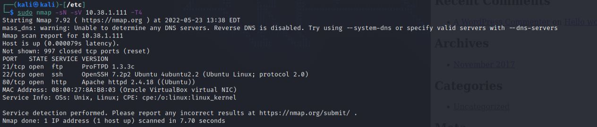
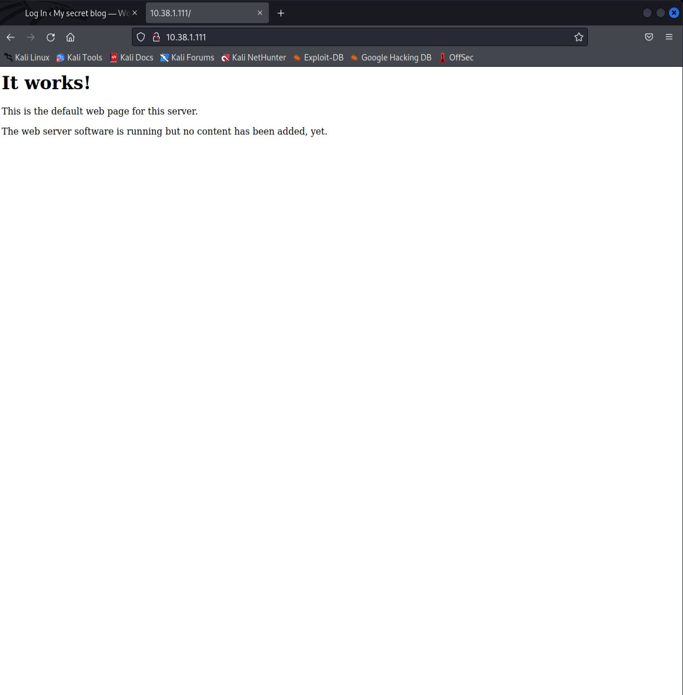
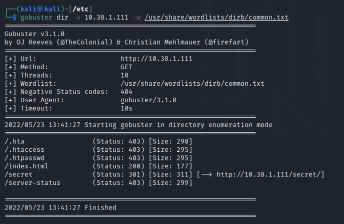
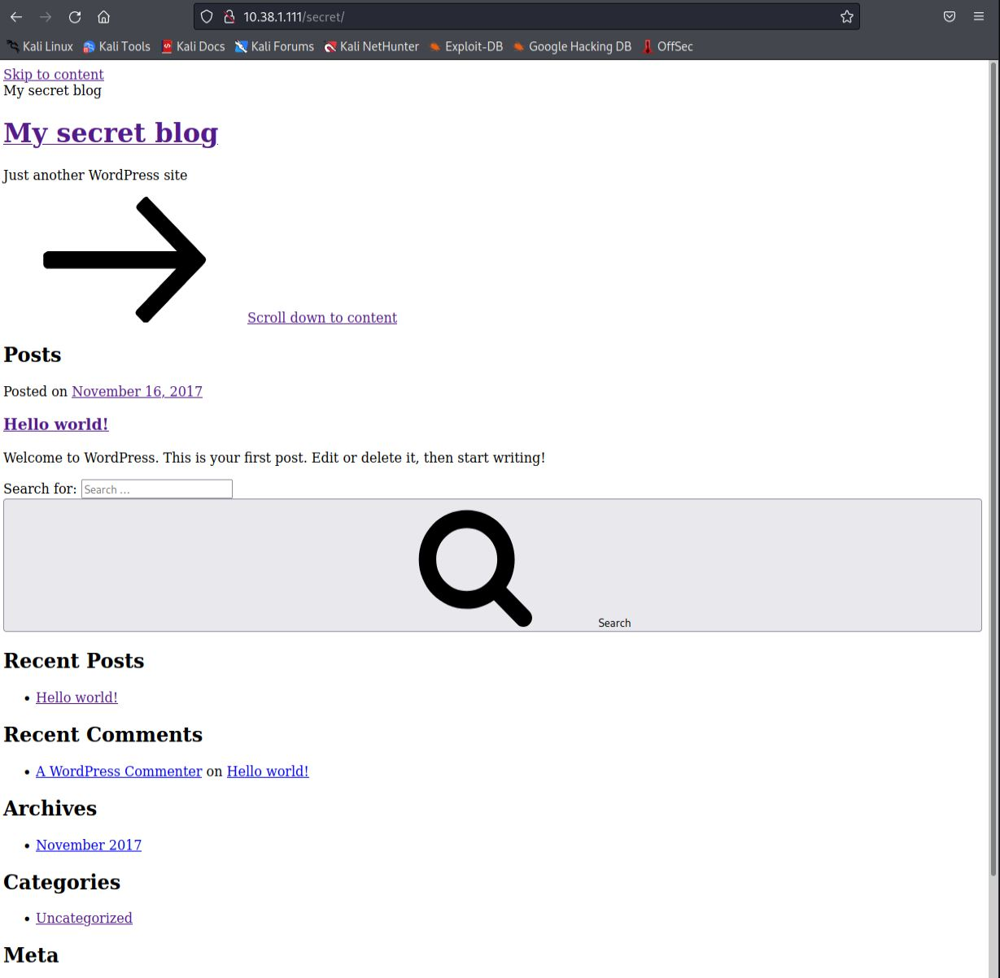
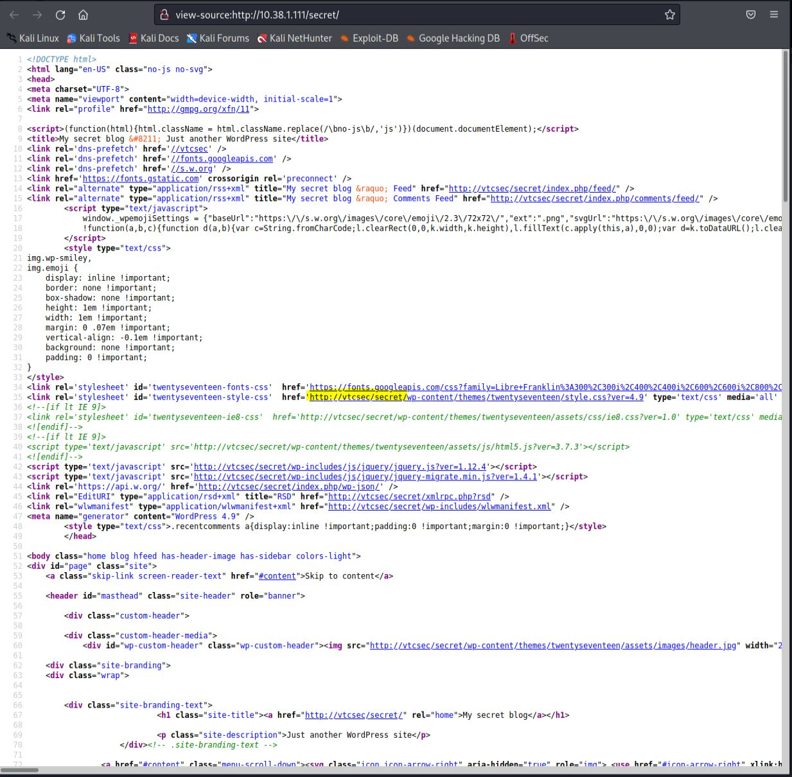
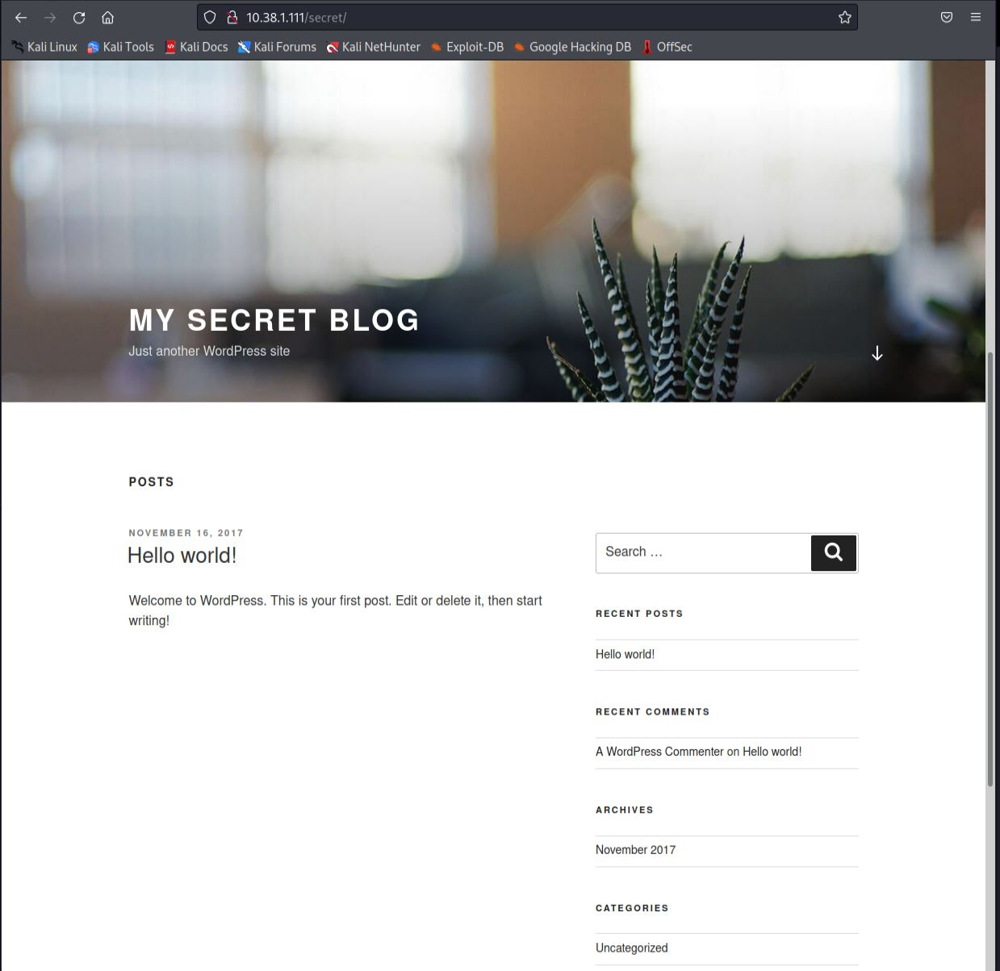
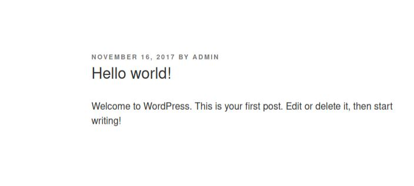
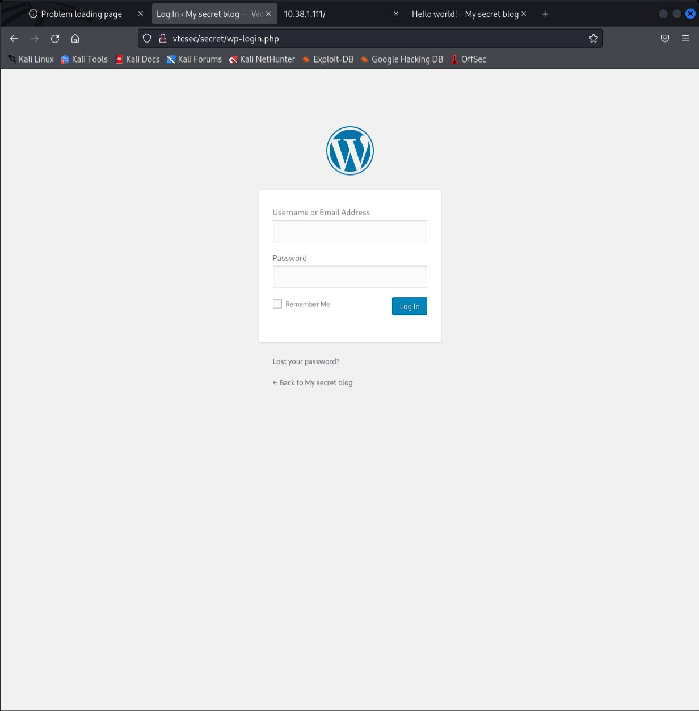
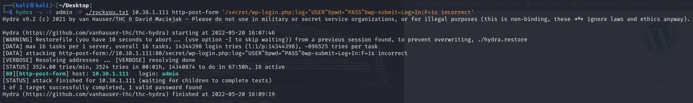

# This is the write up for the Vulnhub box Basic Pentesting: 1

Box Ip Address: 10.38.1.111

Attacking Machine Ip: 10.38.1.110

## **Information Gathering**
---
Starting with an Nmap port Scan we see this output:



We can see the ports open for this box are port 21 `ftp`, port 22 `ssh`, and port 80 `http`.

Port 80 is open so we can make an assumption that this is a web server.

If we navigate in the browser to the address we see this.



Next we can use this command to search for any other directories.

```
gobuster dir -u 10.38.1.111 -w /usr/share/wordlists/dirb/common.txt
```

Where we see these results:



The `/secret` directiory looks interesting but if we navigate to it we see this:



We can see that the page isn't loading quite right.

In order to make the page load correctly we need to add the address to the `/etc/hosts` file. We can also look at the source code for the name of the host:



It looks like the hosts name is vtcsec.

We can enter this command to change the `hosts` file:
```
sudo nano /etc/hosts
```

And then under the `localhost` and `kali` addresses we can add this:

```
10.38.1.111    vtcsec
```

Now if we reload the webpage we are rewarded with a nice looking webpage.



We can click on the only post that has been made and are reward with our first user `admin`



Scrolling to the bottom of the page we see that there is a button to login in, if we click on it we are taken to this login page"



We can use hydra in an attempt to brute force the password using the user `admin` and the wordlist `rockyou.txt`

```
hydra -v -l admin -P /usr/share/wordlists/rockyou.txt 10.38.1.111 http-post-form '/secret/wp-login.php:log=^USER^&pwd=^PASS^&wp-submit=Log+In:F=is incorrect'
```

After a few minutes we are rewarded with this result:



It seems the user `admin` currently has the password `admin`