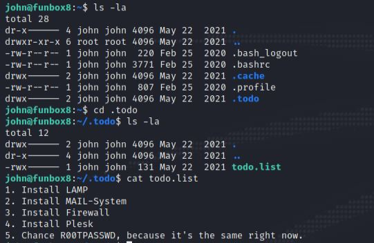

# This is the write up for the Vulnhub box Funbox: Lunchbreaker

Box Ip Address: 10.38.1.117

Attacking Machine Ip: 10.38.1.110
## **Information Gathering**
---
Starting with an Nmap port Scan we see this output:


We can see the ports open for this box are port 21 `ftp`, port 22 `ssh`, and port 80 `http`. 

If we navigate in a web browser to the address we see this:


Nothing too special. Let's look at the source code and make sure nothing is hidden.


It looks like we have fouund a user and email address syntax.

Now that we have the user `jane` let's see if we can use this command to brute force her password for ftp.

```
hydra -l jane -P /usr/share/wordlists/rockyou.txt 10.38.1.114 -t 4 ftp
```

The output of that command looks like this:


We can now log in to ftp as the user `jane` with the super secure password of `password`


Looking at the image above we can see that as we traverse through the directories there is a file called `keys.txt`
We can use this command to view the contents of that file:

```
get keys.txt -
```

We are then given this output:


While we aren't sure what we can use the key for we can navigate to the `/home` and see these users:


If we use the same hydra command as before but change the name after `-l` we may be able to see the ftp passwords for the users:


If we ftp into `jim` using the supplied password, we can see that he has a `.ssh` dircetory containing an `id_rsa` file. Unfortunately that doesn't give us too many clues on what to do with it.


Let's see what `jules` has in her `ftp` folders.


We can see from this output that we have a file labeled `.good-passwd` we can use this command to move that file onto our host machine:

```
mget .good-passwd 10.38.1.110
```

We can also move the `.bad-passwds` file as well.

Use this command to combine the files:

```
cat .good-passwd .bad-passwds >> pass.txt
```

We can create a list of the possible `users`

Then use this command to run through the list of `users` and `passwords` from the files 

```
hydra -L users.txt -P ./pass.txt 10.38.1.117 -t 4 ssh
```

And we find a result!!!


And we can log in using the password... we are now the user `john`


We can traverse around as john and we find a directory called `.todo` with an executable file inside called `.todo.list`. 

If we `cat` that file it gives us something interesting...



So we can assume that the `root` user password is the same as `john`

We `su` to `root` and type in `john`'s password... and we're in!!!

We can then run these series of commands and see this output:

```
cd /root
ls -la

```


If we `cat` the `root.flag` file we are rewarded with the flag: 


# Congratulations!!!

#### Thanks so much for coming along on this journey with me