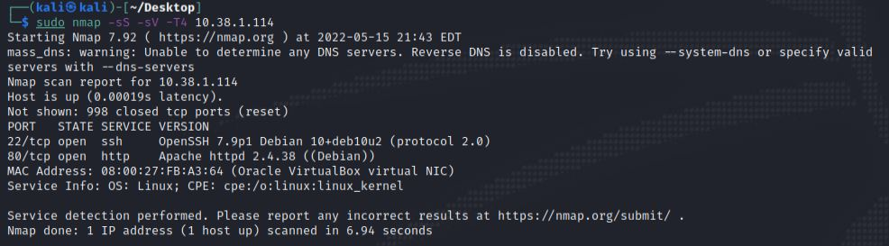
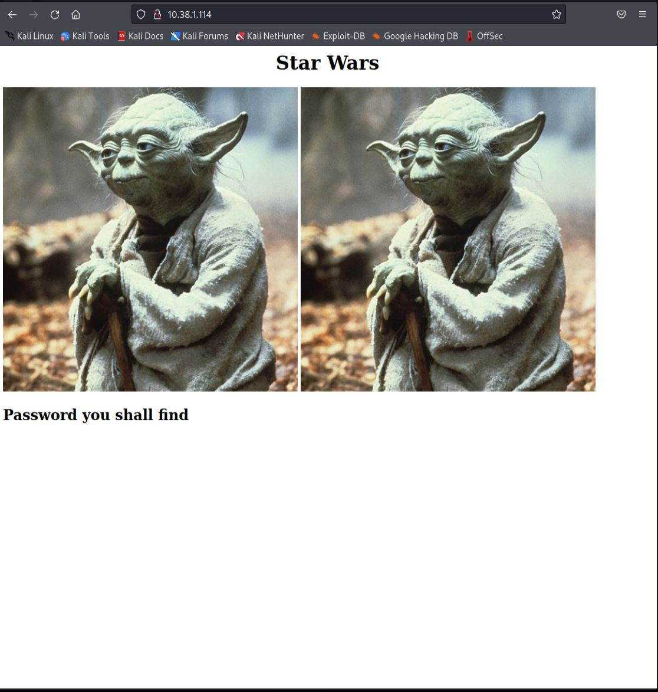
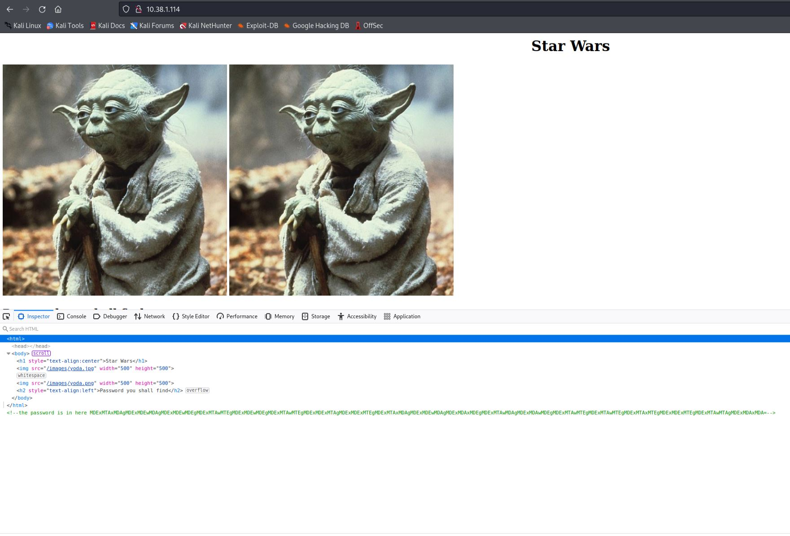
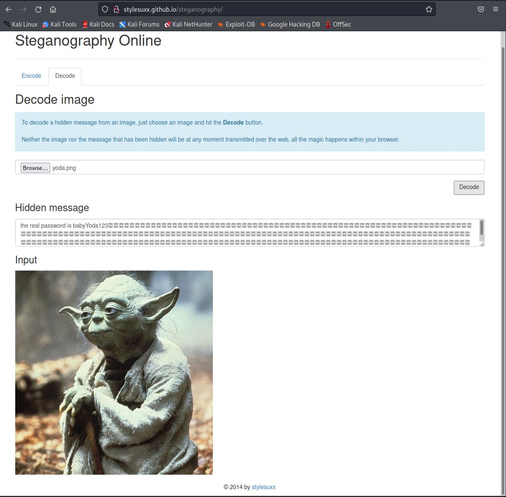
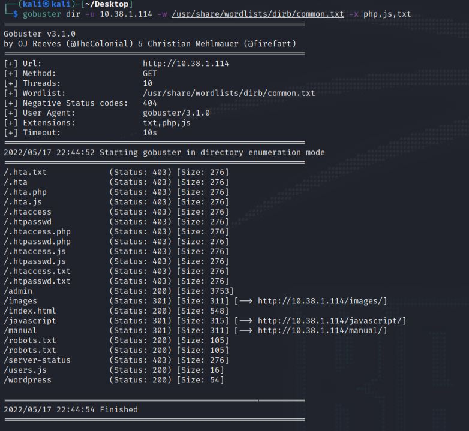
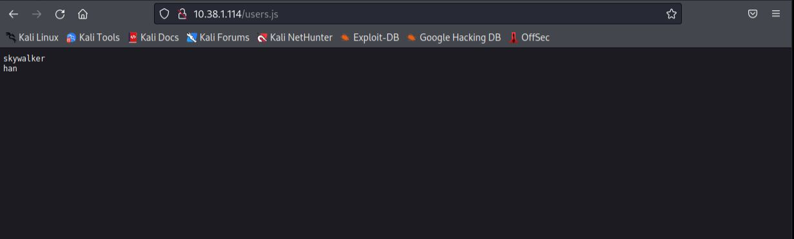
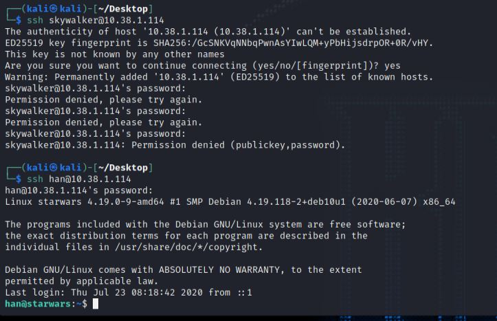
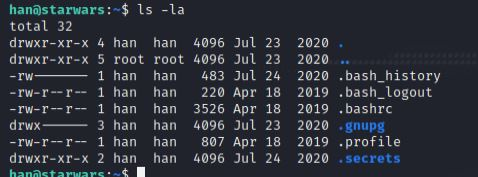
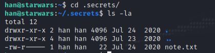
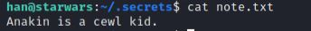

# This is the write up for the Vulnhub box STAR WARS CTF 1 

Box Ip Address: 10.38.1.114

Attacking Machine Ip: 10.38.1.110
## **Information Gathering**
---
Starting with an Nmap port Scan we see this output:



The two open ports are the HTTP port 80 and the SSH port of 22. With port 80 being open, we can assume that this is a web server. Upon navigating to the address `10.38.1.114` we are greeted with this page:



It seems as if there is something hidden on this page. If we look at the inspector code through firefox we see this:



This tips us off that there is, in fact, something hidden here. WWe can use this command to download both the files:

```
wget http://10.38.1.114/images/yoda.jpg
```
and

```
wget http://10.38.1.114/images/yoda.png
```

Since we cannot use the steghide command without a password we turn to online for a `steganography decoder`.

The decoder I used was at this site:

`stylesuxx.github.io/steganography`

Upon uploading the .png image and hitting `decode` we get this output:



So we can see the password is: `babyYoda123`

Now time to find the username(s)

We can use `gobuster` again but this time also specifying for certain file types such as `php` `js` and `txt`.

If we use this command, these are the results:

```
gobuster dir -u 10.38.1.114 -w /usr/share/wordlists/dirb/common.txt -x php,js,txt
```



The `users.js` file looks interesting. Upon navigating to that file this is what we see:



We can see the two users in this file are `han` and `skywalker`

If we navigate to the `/admin` domain we are greeted with this login page:


After trying both users with the password `babyYoda123` we are unable to login. 

However, during our initial nmap scan we saw that the `SSH` port of `22` was open. Maybe one of those users will work with `SSH`



We can see from this output that the user `skywalker` did not work with the password, but the user han did. We are now in as the user `han`

```
ls -la
```

Running this command we can see there is a `.secrets` directory, lets see what is in there.



If we change directories and look into the files we see a `note.txt` file. 



If we `cat` the `note.txt` file this is the output:

 